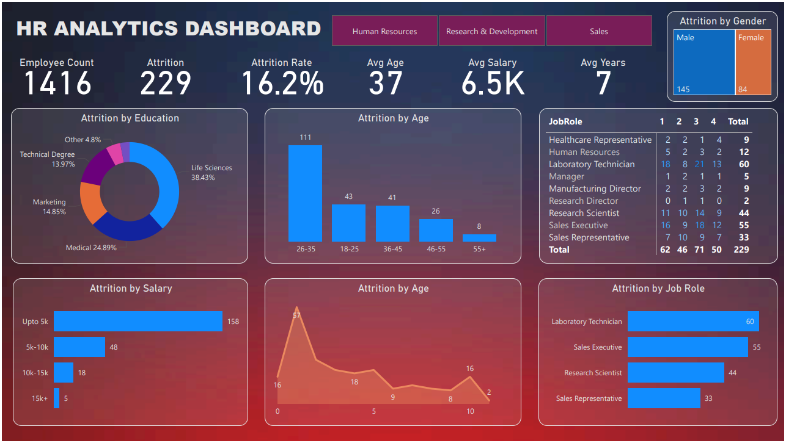

# HR Analytics Dashboard

## Overview

This repository showcases a comprehensive HR Analytics Dashboard created using Power BI. The dashboard provides in-depth insights into employee attrition, a critical metric for understanding workforce dynamics and improving retention strategies. The data analyzed includes various factors such as education, age, salary, job role, and gender—key for identifying trends and making informed HR decisions.

## Data

The dataset used for this dashboard includes the following key metrics:
- **Employee Count**: 1416
- **Attrition**: 229
- **Attrition Rate**: 16.2%
- **Average Age**: 37 years
- **Average Salary**: 6.5K
- **Average Years at Company**: 7 years

## Dashboard Description

The HR Analytics Dashboard is divided into several sections, each providing specific insights into employee attrition:

1. **Attrition by Education**: 
   - Life Sciences: 38.43%
   - Medical: 24.89%
   - Marketing: 14.85%
   - Technical Degree: 13.97%
   - Other: 4.8%

2. **Attrition by Age**:
   - 18-25: 43
   - 26-35: 111
   - 36-45: 41
   - 46-55: 26
   - 55+: 8

3. **Attrition by Salary**:
   - Up to 5k: 158
   - 5k-10k: 48
   - 10k-15k: 18
   - 15k+: 5

4. **Attrition by Gender**:
   - Male: 145
   - Female: 84

5. **Attrition by Job Role**:
   - Laboratory Technician: 60
   - Sales Executive: 55
   - Research Scientist: 44
   - Sales Representative: 33
   - Healthcare Representative: 9
   - Human Resources: 12
   - Manager: 5
   - Manufacturing Director: 9
   - Research Director: 2

6. **Attrition by Age (Line Chart)**:
   - The line chart shows the attrition trend across different age groups, highlighting peaks and troughs in attrition rates.

## Key Findings

- The highest attrition rate is observed in employees aged 26-35, followed by the 18-25 age group.
- Employees with a background in Life Sciences and Medical fields have higher attrition rates compared to other educational backgrounds.
- The majority of attrition occurs in the lower salary bracket (up to 5k).
- Laboratory Technicians and Sales Executives are the job roles with the highest attrition rates.
- Male employees have a higher attrition rate compared to female employees.

## Conclusion

This HR Analytics Dashboard provides valuable insights into employee attrition, helping HR professionals and organizational leaders to identify key areas for improvement in employee retention strategies. By understanding the factors contributing to attrition, organizations can implement targeted interventions to reduce turnover and enhance employee satisfaction.

## How to Use

1. Clone the repository.
2. Open the Power BI file to explore the dashboard.
3. Analyze the data and customize the dashboard as per your organizational needs.

## Contact

For any queries or further information, please contact [Your Name] at [Your Email].

---

This README file aims to showcase my expertise in data analysis and visualization using Power BI. The detailed insights and findings presented in the dashboard demonstrate my ability to analyze complex datasets and provide actionable recommendations, making me a strong candidate for senior data analyst roles and career advancement opportunities.

---

